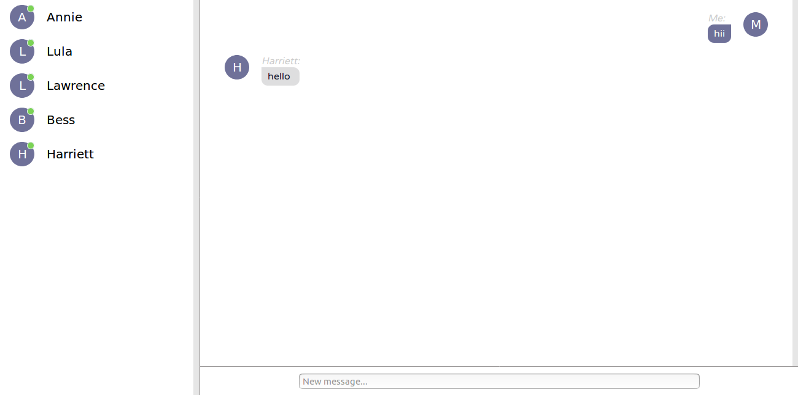

This project is based on FreeCodeCamp example.

## Installation

  You can try it on your own.

  ```shell
    git clone https://github.com/adamkopczynski/react-chat-app.git

    cd react-chat-app

    npm install
    
    node server.js
    
    npm start
  ```
  
## Screenshot

  
